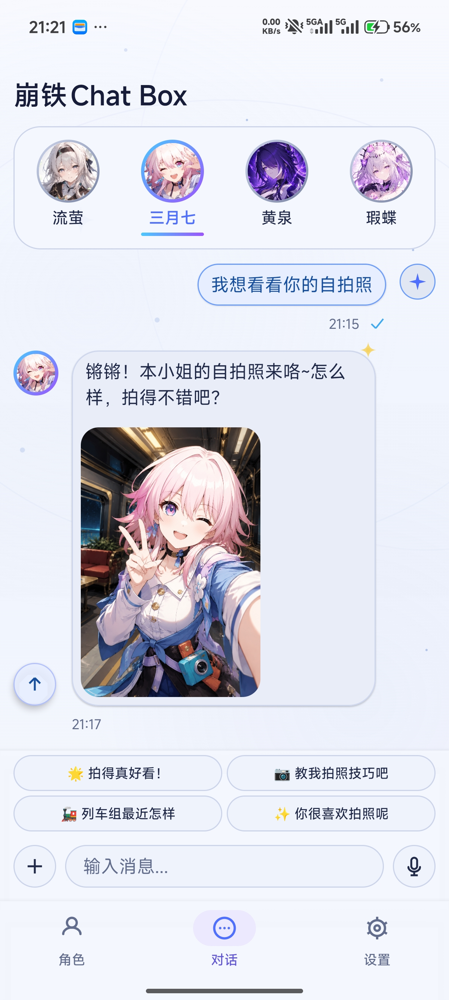
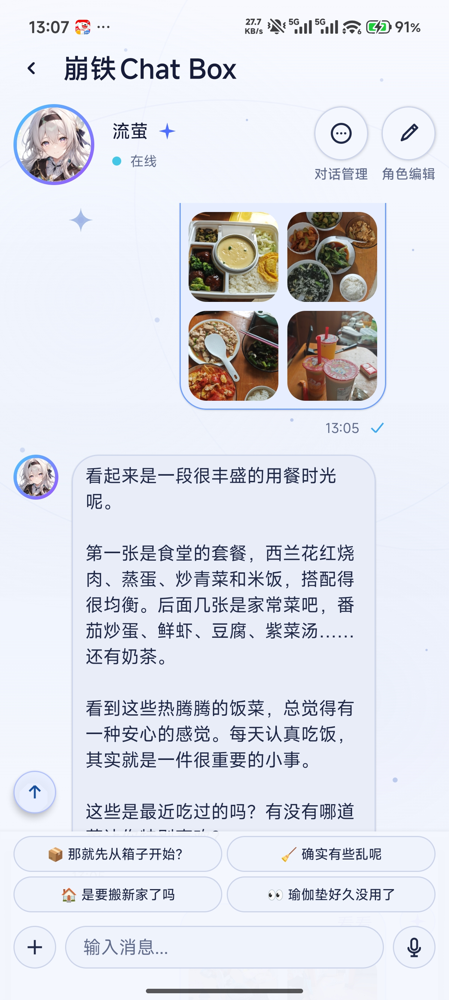
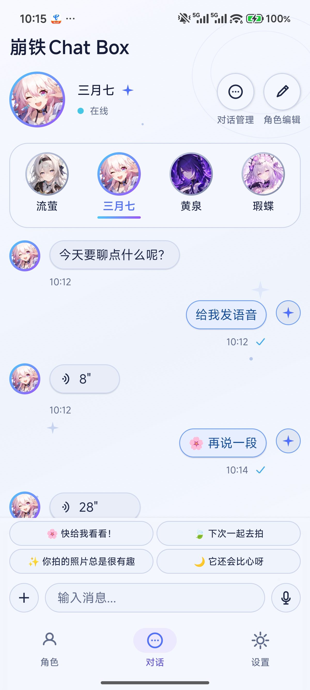
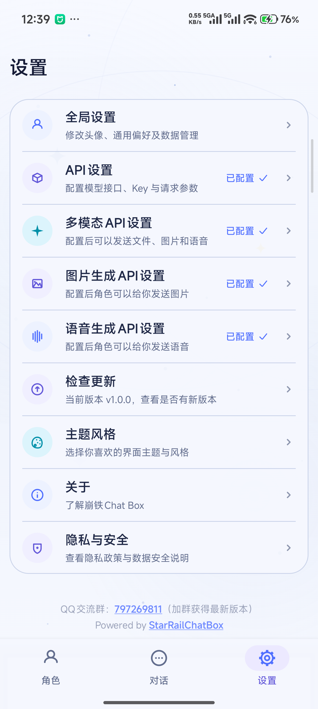
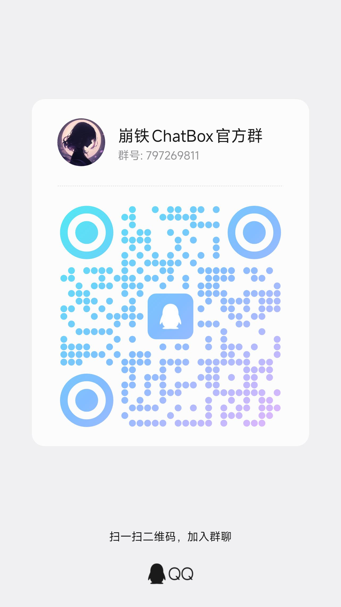

<div align="center">
  <h1>🌠 崩铁ChatBox</h1>
  <p>—— 一款极具沉浸感的跨平台 AI 角色扮演与互动聊天客户端</p>

  <p>
    
    
    
    
  </p>
</div>

---

## 📖 项目简介

**崩铁ChatBox** 是一款极具沉浸感的跨平台 AI 角色扮演与互动聊天客户端。我们致力于提供精美而富有沉浸感的主题对话体验。

除了系统预置的崩坏星穹铁道主题角色，本项目**完全支持用户自由添加并创作任意题材、任意人设的个性化 AI 角色**。无论是科幻、魔幻还是二次元，你都可以通过自定义系统配置出专属的聊天伙伴。

项目基于 **Kotlin Multiplatform (KMP)** 技术，各平台支持状态如下：

| 平台 | 支持状态 | 备注 |
| :--- | :---: | :--- |
| 📱 **Android** | ✅ 支持 | 已发布，运行稳定 |
| 💻 **Windows** | ✅ 支持 | 已发布，运行稳定 |
| 🍏 **iOS** | ⏳ 未来支持 | 规划中 |
| 🖥️ **macOS & Linux** | ⏳ 未来支持 | 规划中 |
| 🌐 **Web (JS/WasmJS)** | ⏳ 未来支持 | 规划中 |

---

## 📸 界面预览

<table align="center">
  <tr>
    <td align="center" valign="top"><br/><sub>精美主题聊天（浅色）</sub></td>
    <td align="center" valign="top"><br/><sub>聊天对话详情</sub></td>
    <td align="center" valign="top"><br/><sub>自定义人设列表</sub></td>
  </tr>
</table>

---

## 🌟 核心功能展示

### 🎨 1. 沉浸式主题视觉美学
- **精致的主题视觉**：精美的渐变色气泡、头像边框、细腻底纹以及极具科技质感的冷青色高光。
- **自适应双色主题**：
  - **浅色模式**：明亮柔和，极具透明感的星空玻璃风格。
  - **深色模式**：深邃的极光底色，弱光环境下护眼且美观。
- **丝滑动态交互**：专为跨平台调校的微动效、气泡滑入、聊天按需加载，带来原生级的流畅反馈。

### 👥 2. 独立多角色并发对话（无锁切换）
- **多角色独立状态**：每一个角色都有完全隔离的聊天线。每个角色拥有独立的聊天记录、草稿箱和发送状态。
- **并发聊天不互锁**：当你在等待某位角色输入和回复时，你可以瞬间切换到其他角色继续聊天，AI 在后台的生成逻辑不受任何干扰。
- **多会话管理**：每一个角色可以拥有多个会话，会话之间互不冲突，自由度拉满。

### 🧠 3. 智能 AI 角色扮演与上下文
- **自定义角色人设**：支持为不同角色设定 System Prompt（人设词）、打招呼开场白。不仅提供内置角色，更支持自定义创作并添加任意题材的全新角色，完美复刻你所构想的性格特征、背景故事与说话语气。
- **长效记忆（自动滚动摘要）**：聊天消息太长导致模型忘事？系统会在消息达到一定数量时，自动在后台对旧消息进行“智库压缩生成滚动摘要”，并保留最近 10 条原文，保证角色记忆持久不间断。

### 📂 4. 多模态附件传输
- **图片与文件识别**：当需要角色帮你识别图片时，只需在对话框中添加图片，系统将自动调用“多模态视觉模型”进行“看图说话”。
- **两阶段文件暂存**：用户选择的媒体/附件在发送前会保存在临时沙盒中，点击发送/保存后才正式入库，保障隐私并防止设备空间被垃圾文件占满。

### 🛠️ 5. 趣味工具系统 (Function Calling)
- **快速回复推荐 (Quick Replies)**：AI 可以根据当前的对话情境，自动为你生成 2-3 个符合当前情境的人设快捷选项，点击即可一键发送。
- **语音合成与克隆**：支持外接语音服务，将角色的文字回复转化为专属语音。
- **图片生成**：AI 会根据对话自动判断是否需要生成图片，并自动调用“图片生成模型”进行图片生成。
- **工具调用降级适配**：当模型不支持工具调用时，仍然会通过 Prompt 注入来实现和工具调用相同的效果。

### ⚙️ 6. 独立五组模型配置
- **精细化模型分配**：你可以为不同任务指派不同模型！
  1. **默认对话模型**：用于默认的文本聊天，人设扮演。
  2. **多模态模型**：专用于处理包含图片、文件等附件的复杂视觉任务。
  3. **语音合成模型** 与 **音色克隆模型**：用于生成生动的人物语音。支持音色克隆，可以克隆对应角色自己的声音。
  4. **图片生成模型**：用于让 AI 的角色扮演更加真实，可以给用户发送图片以及自拍照。

---

## 📱 快速使用（用户）

<div align="center">
  
  <p>⚠️ <b>注意</b>：API设置必须配置后才能使用，其他模型可以不配置，但如果不配置，将无法使用对应功能。</p>
</div>

---

## 📥 角色卡导入与导出 (Import & Export)

本项目完全支持**角色卡的导入与导出功能**，方便开拓者们分享与使用自己调教的角色人设：
- **分享你的角色**：可将精心调教的角色（包含人设 Prompt、开场白及相关配置）一键导出为角色卡文件，分享给其他开拓者。
- **一键体验他人角色卡**：支持直接导入其他开拓者分享的角色卡，免去手动配置人设的繁琐步骤，瞬间复刻完美的聊天伙伴。

<div align="center">
  <br/>
  <sub><b>💬 加入官方Q群，获得更多角色卡</b></sub>
</div>

---

## ☕ 请作者喝杯咖啡 (Sponsor)

如果您觉得本项目对您有所帮助，或者喜欢这个应用，欢迎请作者喝杯咖啡支持一下！您的支持是作者持续维护和开发的最大动力。❤️  
您也可以在 B站 关注作者 [@KaiXuan666](https://space.bilibili.com/170131476) 获取最新的开发动态。

<table align="center">
  <tr>
    <td align="center" style="border: none; padding: 0 20px;">
      <br/>
      <sub><b>支付宝 (Alipay)</b></sub>
    </td>
    <td align="center" style="border: none; padding: 0 20px;">
      <br/>
      <sub><b>微信支付 (WeChat Pay)</b></sub>
    </td>
  </tr>
</table>

---

## 📝 架构设计与核心机制

项目代码设计严格遵循了高共享、高性能和高扩展性的原则，主要有以下几个核心架构设计亮点：

### 1. 业务状态架构 (MVVM & UDF)
- UI 层与状态管理完全解耦。各页面均声明独立的 `UiState`（状态快照）、`Action`（用户意图）和 `Effect`（单次事件，如导航或弹窗）。
- **细粒度状态隔离**：聊天主界面使用了一个全局的独立状态路由机制，通过 `characterStates: Map<String, CharacterChatState>` 来独立管理每位角色的消息列表和输入草稿。这使得 AI 在后台流式输出某位角色的回复时，前端 UI 能够无卡顿地切换到另一位角色，实现了界面数据不冲突、业务逻辑不互锁。

### 2. AI 上下文管理与智能编排
- 聊天请求并不是简单地将历史记录拼接发送，而是经过 `ChatContextBuilder` 的深度编排与裁剪：
  - **Token 控制与裁剪**：系统根据配置的模型最大上下文长度，倒序扫描历史消息并进行 Token 评估。一旦超出设定阈值，会自动裁剪老旧的历史消息。
  - **星轨滚动摘要**：系统后台维护着滚动摘要机制。当未压缩的历史消息到达 30 条时，系统会触发后台线程，通过 AI 自动总结此前对话的滚动大纲存入 `chat_summary`，同时清理老旧的明文聊天记录，只在内存中保留最近 10 条高优先级原文，从而将长文本对话的记忆维持在小而美的高度。
  - **多模态自适应**：系统可以探测消息中是否包含图片附件，并自动在“普通模型”与“多模态视觉模型”之间进行动态路由分配，无需用户手动干预。

### 3. 数据持久化与两阶段文件管理
- **Room KMP 跨平台存储**：针对原生平台（Android/iOS/Desktop），系统采用 Room KMP 进行本地关系型数据库管理，表结构包括 `agent_role`（人设）、`chat_session`（会话）、`chat_message`（消息）、`chat_summary`（摘要）和 `model_config`（模型配置）。而 Web 端由于不支持 SQLite，则通过接口解耦，透明地桥接到浏览器的 LocalStorage 或 IndexedDB。
- **两阶段落盘法 (Cache ➔ Files)**：为了规避用户反复选择/拍摄多媒体文件导致的应用沙盒臃肿，和跨平台文件操作的复杂性，我们设计了“选择即缓存，确认才入库”的两阶段逻辑。用户选中的文件先拷贝至 `Cache` 临时目录，只有在确认点击“发送”或在角色配置中“保存修改”时，文件才会被移动到正式的私有沙盒 `Files` 目录并将路径持久化至数据库。
- **配置高强度加密**：大模型 API Key 属于高度敏感隐私，系统使用 `cryptography-kotlin` 在各平台底层以硬件/系统级加速的方式运行 AES-GCM 高强度加密，密文保存在数据库中。

---

## 👥 贡献者们

感谢以下开拓者对本项目的支持与贡献：

<table align="center">
  <tr>
    <td align="center" style="border: none;">
      <a href="https://github.com/KaiXuan666">
        <br/>
        <sub><b>KaiXuan666</b></sub>
      </a>
    </td>
    <td align="center" style="border: none;">
      <a href="https://github.com/Timo-SakutobeX">
        <br/>
        <sub><b>Timo-SakutobeX</b></sub>
      </a>
    </td>
  </tr>
</table>

---

## 🚀 快速开始

### 1. 配置本地开发环境（开发人员）

在项目根目录下创建一个 `local.properties` 文件（已自动加入 `.gitignore`），后续启动app时无需输入API Key：

```properties
OPENAI_API_HOST=https://api.openai.com/v1
OPENAI_API_KEY=your_api_key_here
```
*(注：开发时此默认配置会被编译进包。正式运行后，用户可在“设置”页面配置个人 API Key，系统会对其进行 AES-GCM 高强度加密并持久化保存)*

### 2. 编译与运行

- **Android 客户端**:
  `./gradlew :androidApp:assembleDebug` 或在 Android Studio 中运行 `androidApp` 配置。
- **Desktop 桌面端 (Windows/macOS/Linux)**:
  - 启动运行：`./gradlew :desktopApp:run`
  - 热重载启动（开发推荐）：`./gradlew :desktopApp:hotRun --auto`
- **Web 浏览器端 (WasmJS)**:
  `./gradlew :webApp:wasmJsBrowserDevelopmentRun` (渲染性能极佳)
- **iOS 客户端**:
  进入 `iosApp` 目录用 Xcode 打开项目直接运行即可。

---

## 📜 开源协议

本项目采用 **GNU General Public License v3.0 (GPLv3)** 协议开源。详细信息请参阅 [LICENSE](LICENSE) 文件。

---

## 🌠 结语

这片银河，期待与你留下更多的足迹。欢迎各位开拓者提交 Issue 与 Pull Request！⭐
